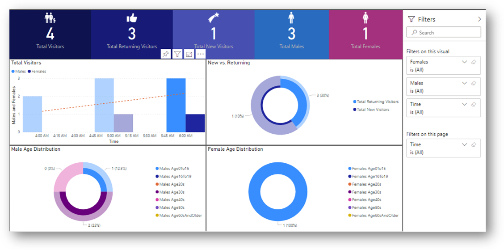

# Whiteboarding & Architecture

## Overview

Crowd analytics (also known as footfall analytics) is about gaining a better understanding of the demographics (age, gender,...) of who is visiting your location, when they are visting, and how many are visting.

The crowd analytics scenario can be used in:

1. Retail shops in many industries (like telecom shops, consumer goods retailers, malls…)
2. Public and Private Parks
3. Events
4. Building safety and evacuation readiness
5. Any many other scenarios

Advanced cloud technologies can provide key business metrics that allow stakeholders to make informative decisions on how to improve experience and/or performance.

### Process Flow

1. A camera device captures a frame and sends it to a central location
2. Devices Hub receives the camera frame message and routes it to a designated system for processing
3. An orchestrator service receives the request and routes it based on the analysis that needs to be performed
4. Camera frame analysis service performs AI-powered face detection and stores the results in a NoSQL database
5. Analysis service picks up the AI-powered analysis and converts it to useful insights that are then stored in a database (aggregating results)
6. Business stakeholder accesses the dashboard with visualized crowd analytics insights.

## Functional Scope

Let's start by understanding the Crowd Analytics platform requirements and scope without any regard to technology:

- **Camera Device**
  - Sending frames to cloud storage
  - Sending telemetry to a centralized hub
- **Centralized Hub for Connected Devices**
  - Ability to manage and monitor all connected devices
  - Ability to push configuration changes to all or some devices
  - Ability to run intelligence at the edge in the future
  - Automatic device provisioning to securely on-board devices at scale
  - Ability to support multiple device communication protocols (HTTPS, AMQP,...)
- **Cognitive Orchestrator Service**
  - Ability to route different AI requests to the appropriate service
    - In our case, a single cognitive type is used (CamFrame-Analysis)
    - For future expansion we also want to have the ability to route a submitted request to a different AI service (like face authentication request)
  - Ability to integrate any transformation here (receiving one format from devices and transform it to a new format to be consumed by the target service)
- **Camera Frame Analyzer Service**
  - Receive a request for a camera frame image to be analyzed
  - Face Detection AI Service: detect faces along with the associated demographics (age, gender and emotion)
  - Persist results from frame analysis to a database
  - Publish an event when frame analysis results have been published
- **Crowd Analyzer Service**
  - Receive a message from a newly analyzed camera frame
  - Do appropriate aggregation to convert a single frame analysis into useful crowd demographics insights
    - Uses a predefined analysis window (by default 60 mins) to aggregate crowd demographics
    - Uses originating device as the context of the analysis (can support multiple devices that are running simultaneously)
  - Persist analytics to a database
  - Publish an event when new or updated demographics information is available
    - Can be used for near-real-time tracking of demographics
- **Cloud Native Orchestrator**
  - Support running containers
  - Ability to manage the infrastructure compute resources
  - Handle services deployment and scheduling
  - Provide auto healing and fault recovery
  - Enterprise grade container registry
- **Integration Service Bus**
  - Microservice architecture depends on messaging and eventual consistency
  - Ability to handle distributed messages at scale
  - Support Publish/Subscribe integration pattern
- **Auto Scaler based on Demand**
  - Scaler must be able to scale automatically based on the size of the messages being processed
  - Each service must have the ability to scale independently
  - Ability to scale down to ZERO
  - Serverless: ability to leverage ad-hoc servers on demand for bursting
- **Monitoring**
  - Ability to monitor all system components (infrastructure, services and external dependencies)
  - Ability to raise alerts when the system is performing below the target performance levels
  - Ability to support near-real-time streaming of logs
- **Security**
  - Identity authentication and authorization
  - Network security
  - Firewalls (including Web-Application-Firewall)
  - Encrypted communications
- **DevOps**
  - All service deployments must be automated via CI/CD
  - No secrets shall be checked in the source code
  - All infrastructure components must be provisioned via parametrized scripts
- **Data Visualization**
  - Platform that is business stakeholder friendly
  - Support both web and mobile platforms for viewing reports
  - Support self-service report creation with an option to add custom calculations and time series intelligent metrics
  - Ability to share reports
  - Ability to slice and dice reports
  - Secure access based on corporate identity

## Technical Scope

Now we can map the functional scope to the relevant technologies that will help us to achieve the target objectives.

## Architecture

Connecting all the above technologies in an architecture to see how each service fits in:

## Next step

Congratulations on completing this section. Let's move to the next step:

[Next Step](../02-prerequisites/README.md)