# Services Deployment

Now it is time to deploy and activate the Crowd Analytics Platform.

## DevOps Setup

I'm hosting the source code on GitHub and using Azure DevOps to manage the other aspects of SDL (Azure Boards for project management, Azure Pipelines for CI/CD and Azure Artifacts for custom NuGet packages).

>NOTE: You should have all the secrets required in this setup from the ```crowdanalytics``` file that was generated as part of the script execution

## Accessing Azure DevOps

Now you need to go to your Azure DevOps organization.

If you don't have one, don't worry! Creating a new free Azure DevOps account is super simple, just visit [dev.azure.com](https://dev.azure.com)

Click [Start free] or [Sign in to Azure DevOps] if you have already done that before:

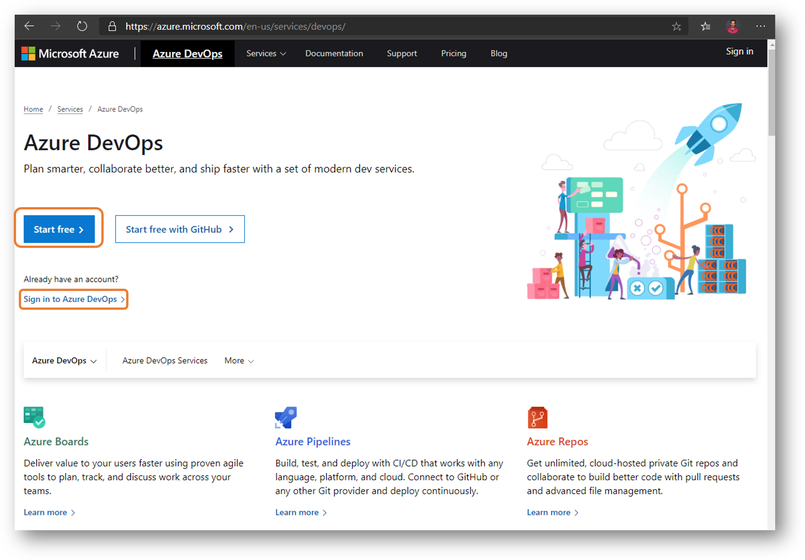

## Creating new Azure DevOps project

Create your a new Azure DevOps project, and setup the initial options

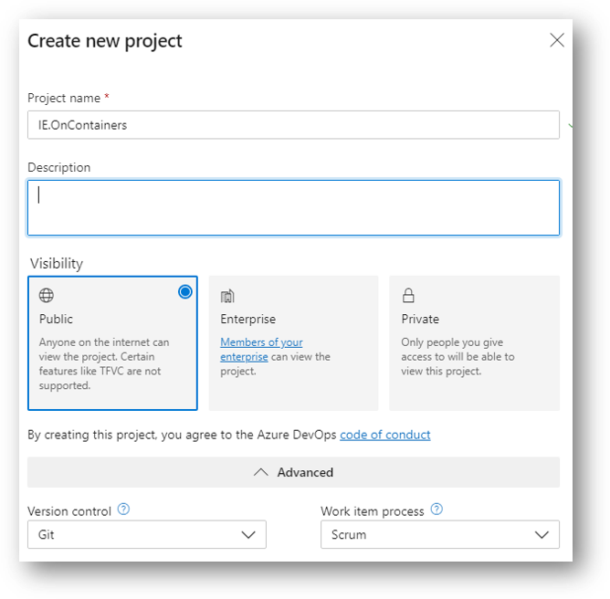

### Connecting to Azure resources

Azure DevOps allows you to provision secure service connections to many external systems (like Kubernetes service and Container Registry).

[Service Connections](https://docs.microsoft.com/en-us/azure/devops/pipelines/library/service-endpoints?view=azure-devops&tabs=yaml) can be used to access external systems in your build and release pipelines.

Now let's create a service connection to Azure Container Registry and AKS:

#### Azure Container Registry Service Connection

Let's add Azure Container Registry service connection so Azure DevOps can push images to be pulled by Kubernetes.

Head up to **Project settings -> Service connections -> Create service connection**:


In the new service connection drop-down list, select **Docker Registry**:

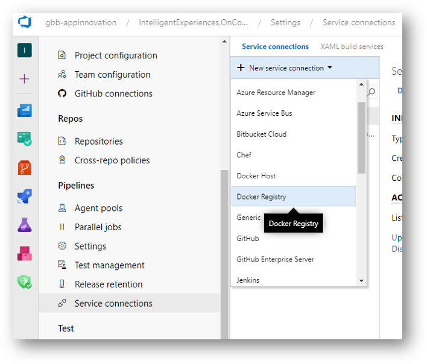

Azure DevOps has tight integration with Azure, so you will find an option for (Azure Container Registry) which you select a subscription and registry and Azure DevOps will provision all the authentication/authorization plumbing on your behalf.

I opted to use **Others** option so it would not matter where that container registry is. I just supplied a registry information:

Please name the service connection name **CrowdAnalyticsACR** so you will not have a problem later with the pipeline definitions.

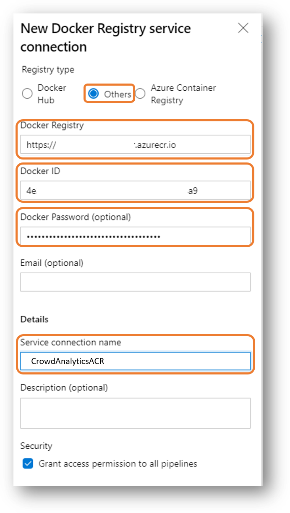

>NOTE: At [Prerequisites] step, we created both Azure Container Registry and a Service Principal. Refer back to this step to get the access information needed to create the new service connection.

#### Azure Kubernetes Service

As you will be deploying the platform services on AKS, I've opted to create another service connection to **Kubernetes**.

You can use Kubeconfig, Kubernetes Service Account or Azure Subscription. Azure Subscription is the easiest option as again all the configuration will handled on your behalf.

>NOTE: Azure Subscription require some elevated permissions in order for it to retrieve a list of all AKS deployments in the subscription. If you faced an error, you can use KUBECONFIG option.

#### Kubernetes Service Connection

Let's create a service connection to our Kubernetes cluster first.

Head to Project settings -> Service connections and select (New service connection) -> Kubernetes.

In the (New Kubernetes service connection blade) select Azure Subscription and fill in the following information:

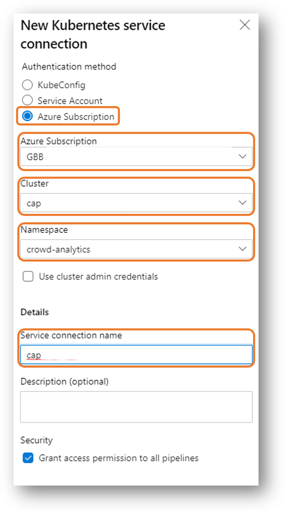

1. Azure Subscription: Your Azure subscription name
2. Cluster: Your cluster name
3. Namespace: crowd-analytics
4. Service connection name: ie-aks-crowd-analytics

Click save and your are good to go :)

### Source Code

If you want to contribute to this workshop (which I would very much appreciate), I would recommend [Forking the GitHub repo](https://aka.ms/IE-On-Containers).

If you wish to use [Azure Repos](https://azure.microsoft.com/en-us/services/devops/repos/) that is an awesome option as well :)

If you wish to clone it and upload it to other source control platforms, then this what you should do :)

I would assume you have forked this repository to your GitHub account and this what you would be using to perform the below steps.

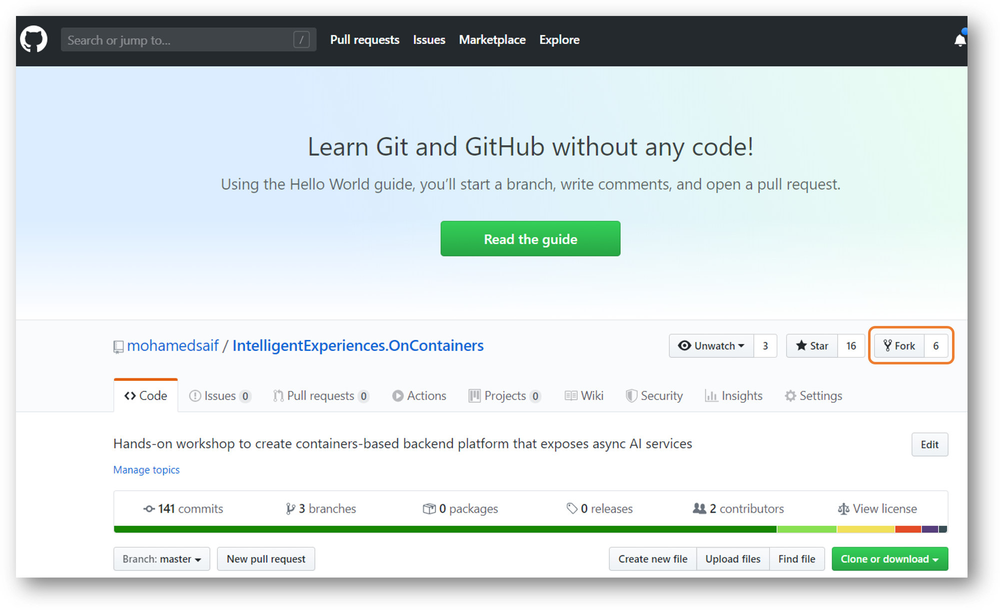

>NOTE: In this workshop guide, I will focus only in one option just to remain focused on the objectives of learning end-to-end life cycle of building and deploying cloud native workloads.

### Continuos Integration

The workshop leverages Azure Pipelines yaml configuration checked at the root of this workshop code.

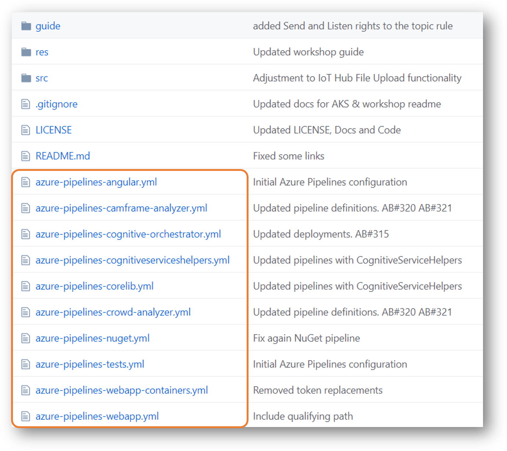

#### Importing Services Pipelines

Overview of CI pipelines:

- Service: CognitiveOrchestrator
- Service: CamFrameAnalyzer
- Service: CrowdAnalyzer

To start importing these pipelines into your Azure DevOps project, just click on **Create Pipeline** under (Pipelines -> Builds)

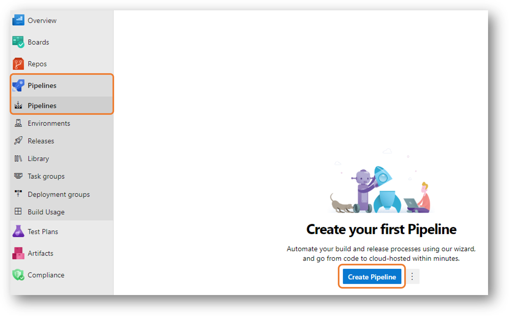

Select (GitHub YAML) or (Azure Repos Git YAML) based on where is your code:


>NOTE: Selecting GitHub for the first time, you will need to connect Azure DevOps to your GitHub account. If you have challenges, you can review the following lab [Integrate Your GitHub Projects With Azure Pipelines](https://azuredevopslabs.com//labs/azuredevops/github-integration/)

Next you select the project repo. It will differ based on you selection in the previous step (**I**'m using GitHub to host the code):

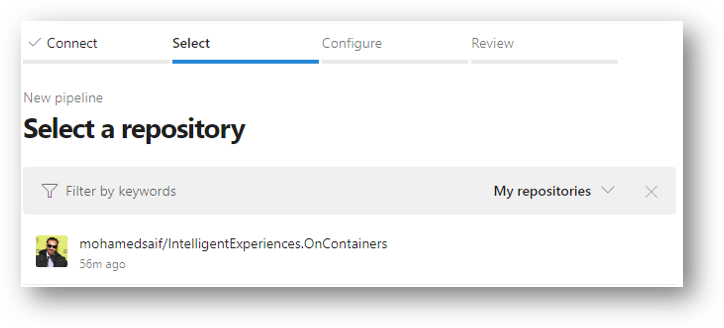

As we are not starting from scratch, you can select **Existing Azure Pipelines YAML file**:


Select one of the following yaml files (you will repeat the steps for all the others):

- azure-pipelines-cognitive-orchestrator.yml
- azure-pipelines-camframe-analyzer.yml
- azure-pipelines-crowd-analyzer.yml

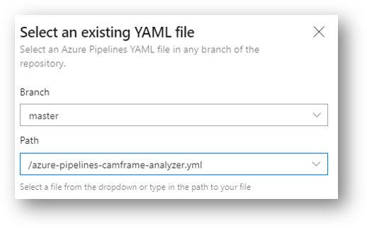

Finally review the content of the yaml file and click on Run to queue a new build process:

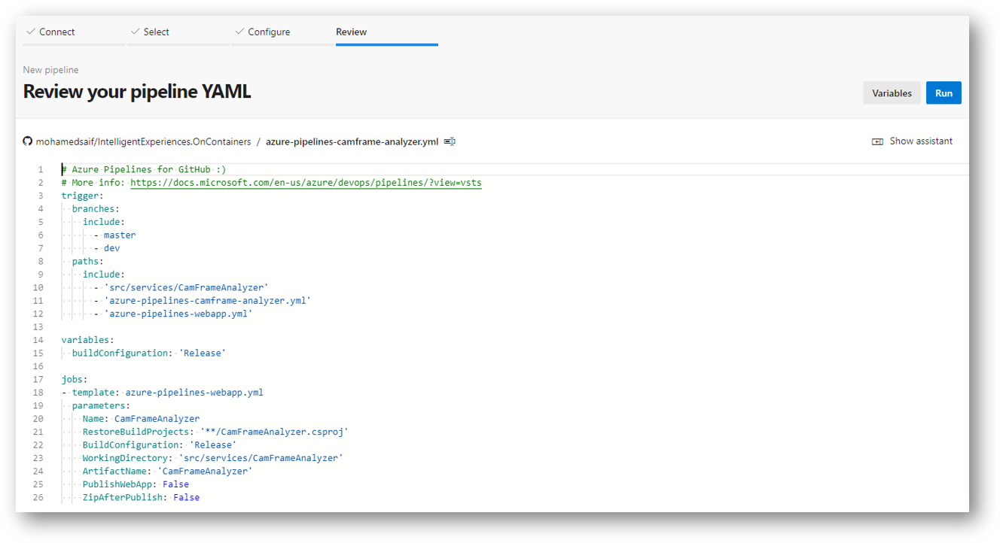

CONGRATULATIONS! You first pipeline is now being built.

Please repeat the above steps for each pipeline yaml definitions mentioned above.

>NOTE: This repo includes various template files that are leveraged by the main pipeline definition mentioned here (azure-pipelines-cognitive-orchestrator.yml). These template files will not be used to create pipelines directly. Template files end with angular, webapp, nuget and tests)

#### (OPTIONAL) Importing NuGet Pipelines

The project leverages shared NuGet packages that consolidate common code functionality as a best practice.

Although you don't need to create your own NuGet Azure Artifacts as I'm publishing the needed NuGet on my public Azure Artifacts repository, you might want to have a look and the build pipeline definitions for them:

- NuGet: CoreLib (azure-pipelines-corelib.yml)
- NuGet: CognitiveServicesHelpers (azure-pipelines-cognitiveserviceshelpers.yml)

>NOTE: My Azure Artifacts repo used in public, so you shouldn't face problems restoring the packages I've pushed their. If you received errors in the build, it is worth mentioning that you might need to setup an Azure Artifacts repo, push the Workshop NuGet packages to and then try to build again after updating your nuget.config files with the new source.

>NOTE: Check [Azure Artifacts](https://docs.microsoft.com/en-us/azure/devops/artifacts/get-started-nuget?view=azure-devops) documentations for more information or check our a blog post about [Public Azure Artifacts Feeds](https://devblogs.microsoft.com/devops/new-with-azure-artifacts-public-and-project-scoped-feeds/)

#### House keeping

Now if you added all 5 pipelines (3 services and 2 NuGet packages), you will end up with something like:

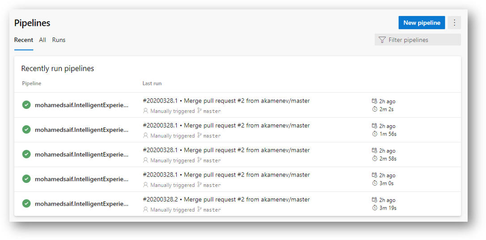

Confusing a bit! You can now update the names of each pipeline to reflect each pipeline function. 

Select **Rename** from the ellipses beside the build definition to update:

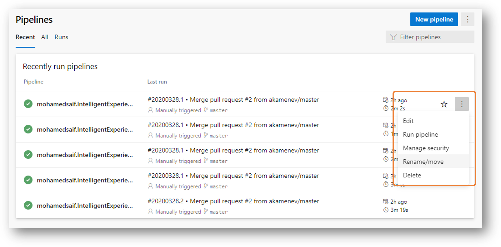

Now you can end up with something more relevant like:

- CrowdAnalytics-Svc-CognitiveOrchestrator-CI
- CrowdAnalytics-Svc-CamFrameAnalyzer-CI
- CrowdAnalytics-Svc-CrowdAnalyzer-CI

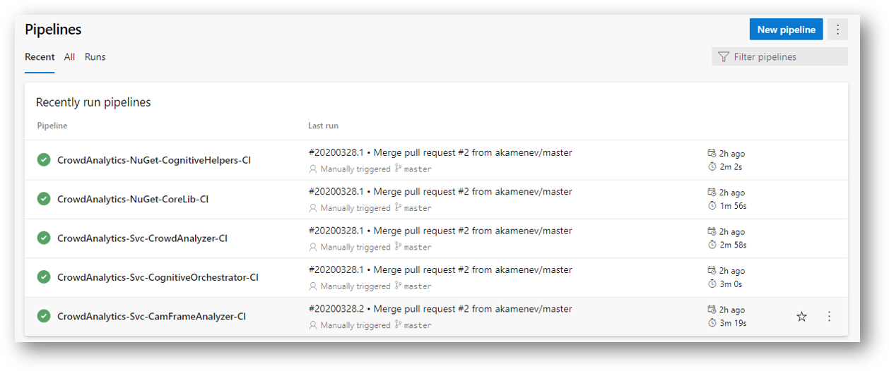

### Continuos Delivery

Creating Release Pipelines to actually deliver the target services to your Azure cloud services and or other release destinations (like NuGet repository).

>NOTE: You will need all the connection strings, keys and values you captured during the previous steps to provision your release pipelines.

#### Azure DevOps Release Pipelines

We will use Azure DevOps Release exported definitions as a starting point and then configure them.

>**IMPORTANT:** Release Pipelines in this workshop depend on an external components called [Replace Tokens](https://marketplace.visualstudio.com/items?itemName=qetza.replacetokens). Please make sure your installed it on your Azure DevOps organization before importing the new release pipelines.

You can find the templates in [src/devops-cd](../../src/devops-cd). Make sure you have them downloaded to your machine.

>**IMPORTANT:** There is a challenge as of writing this that you need at lease 1 release pipeline defined and saved before you can import any pipelines. As a workaround, click on **Create pipeline** then select **Empty job** and finally click **Save**. After that return back to Releases (from the left navigation) to go to a view similar to what is being discussed in the following steps.

Head to your project Releases and click (New -> Import release pipeline):

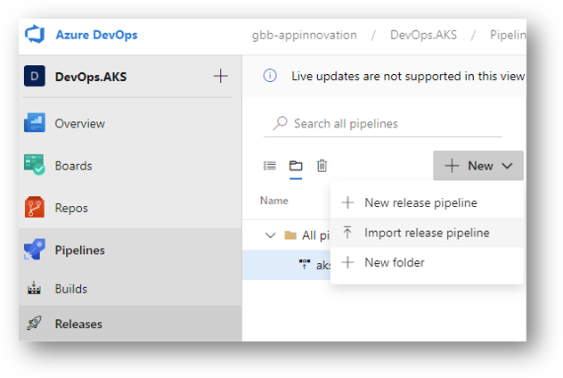

Browse to your local deployment file named (IE.OnContainers.CognitiveOrchestrator-CD.json).

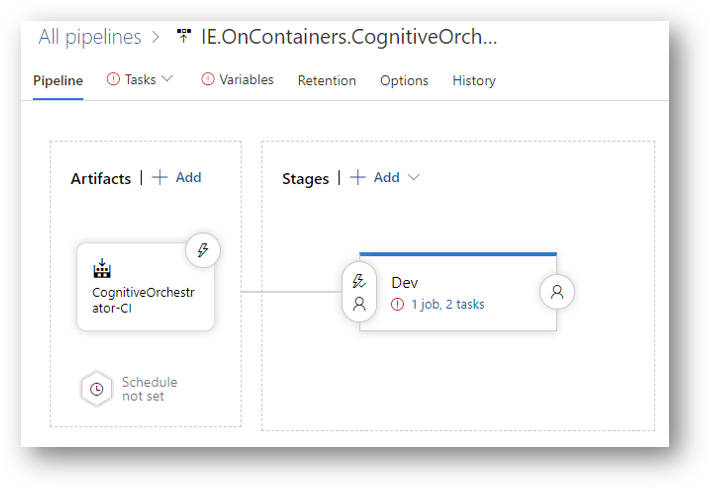

Now you need to delete the existing artifact to create a new one that will link to the relevant CI pipeline artifacts.

Just click on the artifact named (CognitiveOrchestrator-CI) and then delete it.

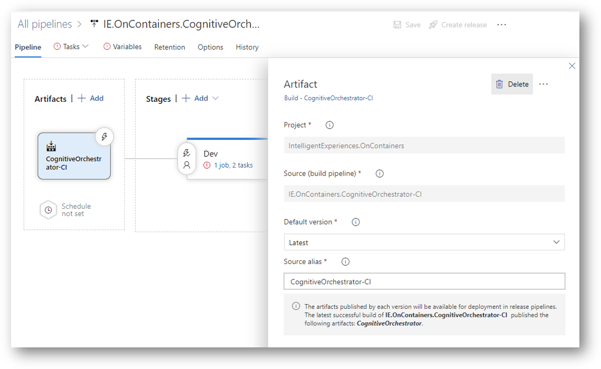

Now add a new artifact that points to the relevant build pipeline. Make sure to give it the **Source alias** as (CognitiveOrchestrator-CI).

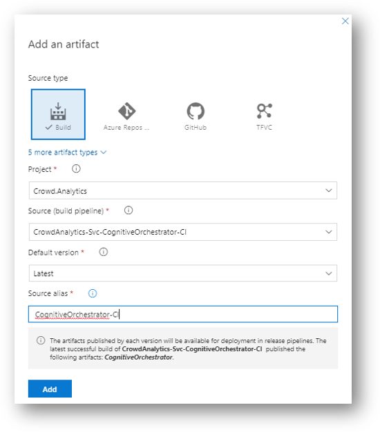

Head to the tasks under the (Dev) stage in the release designer.

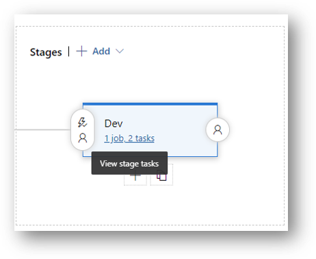

Configure the agent properties as per the following (Agen Pool: Azure Pipelines, Agent Specification: Ubuntu-18.04):

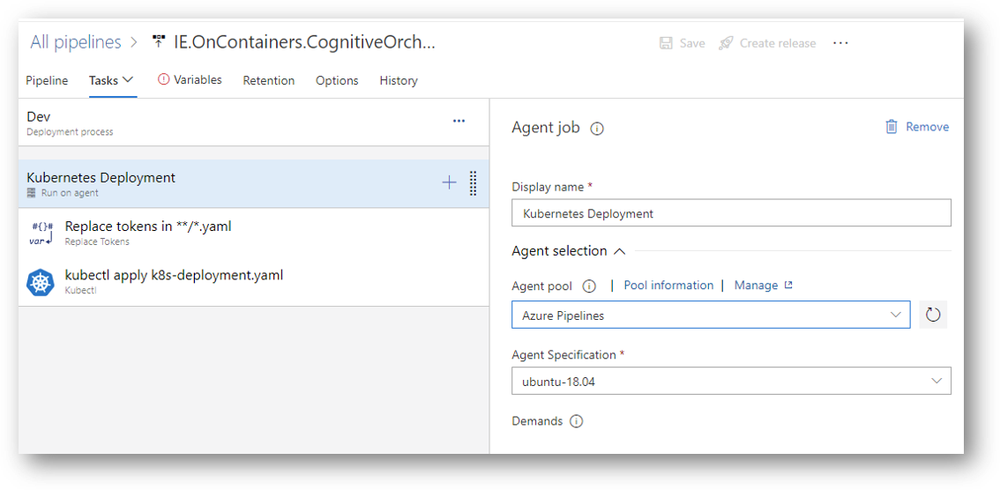

Now update the Kubernetes task to use the previously created service connection to your Kubernetes cluster:

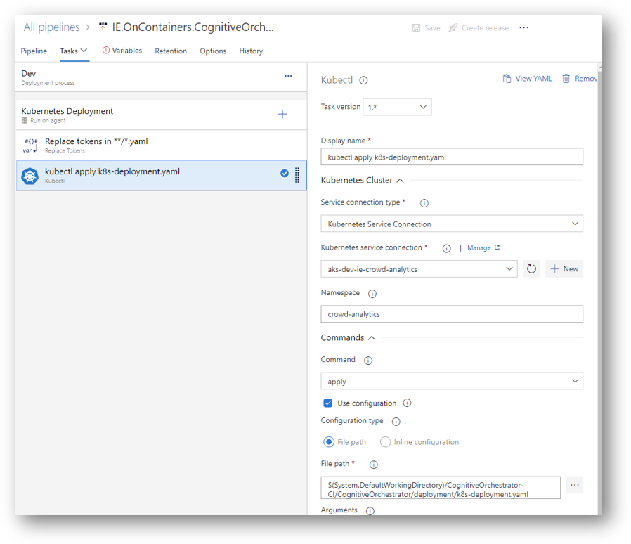

Final thing is the update the pipeline variables as the Kubernetes deployment file will replace the secrets with values from the release variables (through Replace Tokens) task.

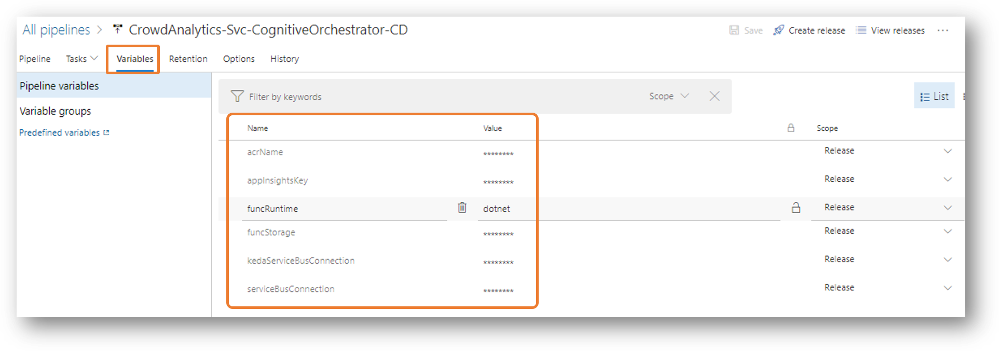

To make it easier, below is the mapping of script saved variables (you should have ```crowdanalytics``` file generated during the script execution):

##### CrowdAnalytics-Svc-CognitiveOrchestrator-CD Variables

| Pipeline Variable        | Script Variable          | Description                                                    |
|--------------------------|--------------------------|----------------------------------------------------------------|
| acrName                  | CONTAINER_REGISTRY_URL   | YOURCONTAINERNAME.azurecr.io                                   |
| appInsightsKey           | APPINSIGHTS_KEY_ORCH     | Application Insights instrumentation key                       |
| funcRuntime              | dotnet                   | For Azure Functions runtime                                    |
| funcStorage              | FRAMES_STORAGE_CONN      | Used by Azure Functions                                        |
| kedaServiceBusConnection | SB_TOPIC_ORCH_CONNECTION | Connection string specific to single topic (cognitive-request) |
| serviceBusConnection     | SB_NAMESPACE_CONNECTION  | Root connection string to your Service Bus                     |

Now click save, then click create release to run the pipeline.

Now you can repeat the above steps for each service and NuGet library part of this solution.

Here is the other pipeline variable mapping as well:

##### CrowdAnalytics-Svc-CamFrameAnalyzer-CD Variables

| Pipeline Variable         | Script Variable         | Description                                                                      |
|---------------------------|-------------------------|----------------------------------------------------------------------------------|
| acrName                   | CONTAINER_REGISTRY_URL  | YOURCONTAINERNAME.azurecr.io                                                     |
| appInsightsKey            | APPINSIGHTS_KEY_CAM     | Application Insights instrumentation key                                         |
| camFrameStorageConnection | FRAMES_STORAGE_CONN     | This is the storage account the camera frames are uploaded to                    |
| cognitiveEndpoint         | CS_ACCOUNT_ENDPOINT     | Usually in the format (https://AZURE-REGION.api.cognitive.microsoft.com)         |
| cognitiveKey              | CS_ACCOUNT_KEY          | Your cognitive services access key                                               |
| cosmosDbEndpoint          | COSMOSDB_PRIMARY_CONN   | Take only the part after AccountEndpoint in the connection                       |
| cosmosDbKey               | COSMOSDB_PRIMARY_CONN   | Copy only the part after AccountKey in the connection                            |
| faceWorkspaceDataFilter   | Contoso.CrowdAnalytics  | This is a static value represent the person group (for identified faces feature) |
| funcRuntime               | dotnet                  | For Azure Functions runtime                                                      |
| funcStorage               | FRAMES_STORAGE_CONN     | Used by Azure Functions                                                          |
| kedaServiceBusConnection  | SB_TOPIC_CAM_CONNECTION | Connection string specific to single topic (camframe-analysis)                   |
| serviceBusConnection      | SB_NAMESPACE_CONNECTION | Root connection string to your Service Bus                                       |

##### CrowdAnalytics-Svc-CrowdAnalyzer-CD Variables

| Pipeline Variable        | Script Variable           | Description                                                                      |
|--------------------------|---------------------------|----------------------------------------------------------------------------------|
| acrName                  | CONTAINER_REGISTRY_URL    | YOURCONTAINERNAME.azurecr.io                                                     |
| appInsightsKey           | APPINSIGHTS_KEY_CAM       | Application Insights instrumentation key                                         |
| checkForDbConsistency    | true                      | A flag so used when updating the cosmos db crowd data                            |
| cosmosDbEndpoint         | COSMOSDB_PRIMARY_CONN     | Take only the part after AccountEndpoint in the connection                       |
| cosmosDbKey              | COSMOSDB_PRIMARY_CONN     | Copy only the part after AccountKey in the connection                            |
| faceWorkspaceDataFilter  | Contoso.CrowdAnalytics    | This is a static value represent the person group (for identified faces feature) |
| funcRuntime              | dotnet                    | For Azure Functions runtime                                                      |
| funcStorage              | FRAMES_STORAGE_CONN       | Used by Azure Functions                                                          |
| kedaServiceBusConnection | SB_TOPIC_CROWD_CONNECTION | Connection string specific to single topic (crowd-analysis)                      |
| serviceBusConnection     | SB_NAMESPACE_CONNECTION   | Root connection string to your Service Bus                                       |
| origin                   | CrowdAnalyzer.V1.0.0      | Static value indicate the originating crowd calculations                         |

## Running Crowd Analytics Platform

Now you are ready to check that the deployed components are up and healthy.

### Kubernetes Services Test

Let's check that every part of the deployment works

#### AKS Services

You have mainly 3 components running on AKS:

- Cognitive Orchestrator: gets any new messages coming from IoT Hub and send them to the appropriate processor. Currently we have only [Camera Frame Analyzer] service.
- CamFrame Analyzer: look for faces in image, persist similar faces and identify any faces against a predefined list and then publish frame analysis results with basic demographics information.
- Crowd Analyzer: taking an analyzed Camera Frame and produced 1-hour demographics view (total males, total females, age groups, emotions,...) and persist the results in db so it can be displayed in a dashboard.

All services are deployed to AKS in a namespace called [crowd-analytics]. Let's check all deployments:

```bash

# Get everything deployed to the namespace (crowd-analytics)
kubectl get all -n crowd-analytics
# Healthy output should look like this:
# NAME                                          READY   STATUS    RESTARTS   AGE
# pod/cognitive-orchestrator-54db94b464-tgkcp   1/1     Running   0          6h3m

# NAME                                     READY   UP-TO-DATE   AVAILABLE   AGE
# deployment.apps/camframe-analyzer        0/0     0            0           5h16m
# deployment.apps/cognitive-orchestrator   1/1     1            1           18h
# deployment.apps/crowd-analyzer           0/0     0            0           4h35m

# NAME                                                DESIRED   CURRENT   READY   AGE
# replicaset.apps/camframe-analyzer-6cf5cfcb8b        0         0         0       5h16m
# replicaset.apps/camframe-analyzer-b944997f9         0         0         0       4h42m
# replicaset.apps/camframe-analyzer-f9699db64         0         0         0       5h13m
# replicaset.apps/cognitive-orchestrator-54db94b464   1         1         1       6h3m
# replicaset.apps/cognitive-orchestrator-76fb5f684c   0         0         0       18h
# replicaset.apps/cognitive-orchestrator-f77777956    0         0         0       7h8m
# replicaset.apps/crowd-analyzer-5f69ff4b4b           0         0         0       4h35m

# NAME                                                                  REFERENCE                           TARGETS              MINPODS   MAXPODS   REPLICAS   AGE
# horizontalpodautoscaler.autoscaling/keda-hpa-camframe-analyzer        Deployment/camframe-analyzer        <unknown>/10 (avg)   1         50     
# horizontalpodautoscaler.autoscaling/keda-hpa-cognitive-orchestrator   Deployment/cognitive-orchestrator   0/10 (avg)           1         20     
# horizontalpodautoscaler.autoscaling/keda-hpa-crowd-analyzer           Deployment/crowd-analyzer           <unknown>/10 (avg)   1         50

kubectl get deployment -n crowd-analytics
# Results could look like this:
# NAME                     READY   UP-TO-DATE   AVAILABLE   AGE
# camframe-analyzer        0/0     0            0           12m
# cognitive-orchestrator   1/1     1            1           11m
# crowd-analyzer           0/0     0            0           12m

# You can get details about a specific deployment using:
kubectl describe deployment camframe-analyzer -n crowd-analytics

# Check the deployed pods (if you have all 0 you will not get any results)
kubectl get pods -n crowd-analytics

# In addition to the above, you can access KEDA scaler logs as well:
kubectl get pods -n keda
# Output should look like
# NAME                                               READY   STATUS    RESTARTS   AGE
# keda-operator-dbfbd6bdb-qnn6g                      1/1     Running   0          22h
# keda-operator-metrics-apiserver-8678f8c5d9-nhw2l   1/1     Running   0          22h

# To access the logs of the main KEDA operator, you can execute (replace with the actual KEDA pod name)
kubectl logs REPLACE_KEDA_POD_NAME -n keda

# Save logs to a file
kubectl logs REPLACE_KEDA_POD_NAME -n keda > keda.logs

```

One of the amazing aspects of KEDA's ```ScaledObject``` that it can scale down to 0 and scale up to N based on the event trigger (in this case we are using Service Bus trigger).

>NOTE: In KEDA ```ScaledObject``` definition for each service, you can set the ```minReplicaCount``` to 0 like in camframe-analyzer. I've set the cognitive-orchestrator minimum to 1 (that is why it show 1/1). ```ScaledObject``` definition is found in each service source code under the deployment folder.

##### Cam Device Web (Simulated)

Open the [src/iot/Cam.Device.Web/Cam.Device.Web.csproj](cam.../../src/iot/Cam.Device.Web/Cam.Device.Web.csproj) project in Visual Studio or Visual Studio code.

Update the following settings #{VARIABLE}# in (appSettings.json) with your values before running the project:

```json

{
  "Logging": {
    "LogLevel": {
      "Default": "Information",
      "Microsoft": "Warning",
      "Microsoft.Hosting.Lifetime": "Information"
    }
  },
  "AllowedHosts": "*",
  "AppSettings": {
    "DeviceId": "Device-Web-Sim-001",
    "DeviceConnectionString": "#{DeviceConnectionString}#",
    "IsEdgeModeEnabled": false,
    "StorageConnection": "#{StorageConnection}#",
    "StorageContainer": "camframefiles"
  }
}

```

Now build and run the ASP .NET Core website locally. Grant permission to the camera to allow it to collect the frames.

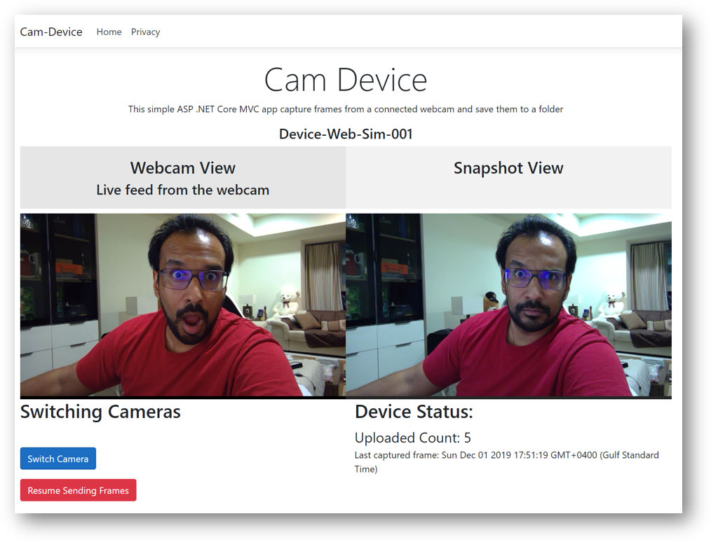

By default, every 15 seconds a javascript code take a snap of the camera. Camera frame are then uploaded to Azure Storage and a new IoT Hub event is sent.

**Cleanup Quick Tips:**

In the script below, you can find some useful tips:

```bash

# Manually cleaning the deployed services:
kubectl delete deployment camframe-analyzer -n crowd-analytics
kubectl delete deployment cognitive-orchestrator -n crowd-analytics
kubectl delete deployment crowd-analyzer -n crowd-analytics

kubectl delete secret camframe-analyzer -n crowd-analytics
kubectl delete secret crowd-analyzer -n crowd-analytics
kubectl delete secret cognitive-orchestrator -n crowd-analytics

kubectl delete ScaledObject camframe-analyzer -n crowd-analytics
kubectl delete ScaledObject crowd-analyzer -n crowd-analytics
kubectl delete ScaledObject cognitive-orchestrator -n crowd-analytics

# Delete everything in a namespace :)
kubectl delete all --all -n crowd-analytics

```

### Azure Monitor & App Insights

It is crucial to maintain visibility on how the system is performing. **Azure Monitor** wide offering allows developers and SREs to gain valuable insights on the systems they develop/operate.

#### Application Insights

If you configured app insights keys for each service, you can visit the app insights for a sneak peak on how your system is performing:

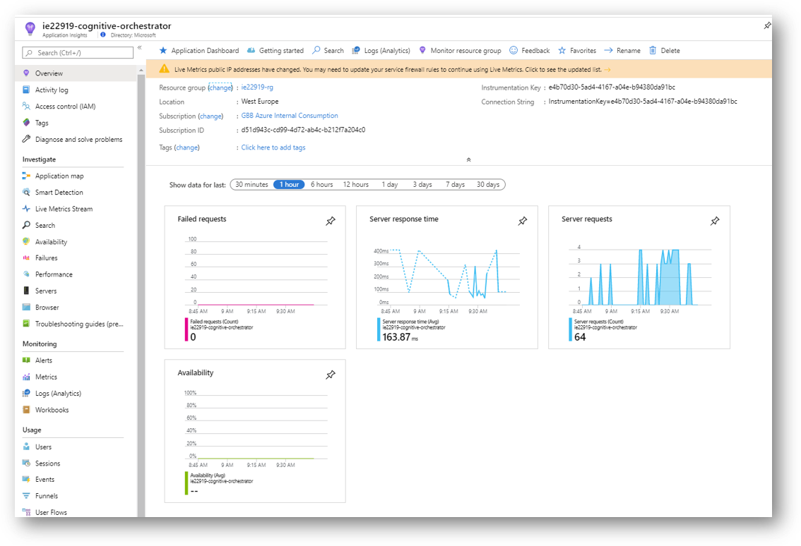

One of the cool things about **Application Insights** is the dependency mapping. Check the Application Map to see how is your service dependencies are performing:

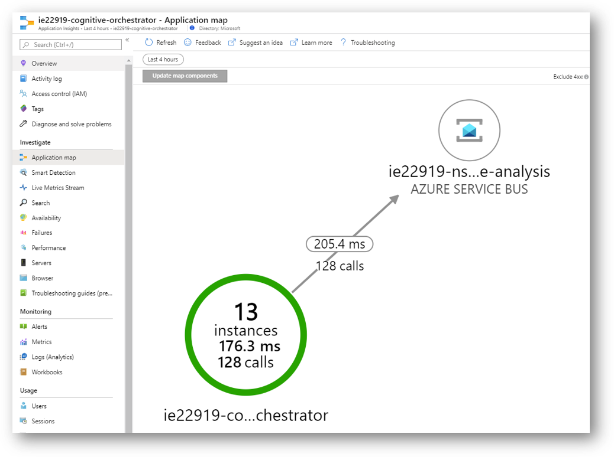

#### AKS Insights

Enabling AKS insights as part of provisioning the cluster gives you access to really detailed insights about the cluster performance.

Take a look into these metrics by selecting your kubernetes cluster -> Insights

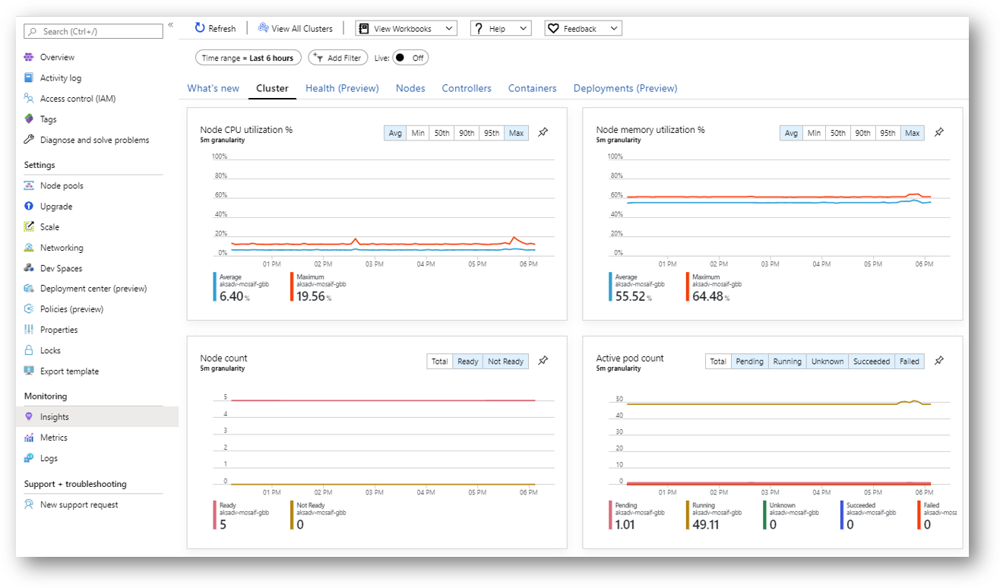

You can even monitory your deployments of the crowd-analytics platform:


You have issue and you need to stream live the logs, either use ```kubectl logs``` or leverage Azure Monitor to connect to the pod and stream the logs right inside Azure Portal by clicking the "View live data" button.

>NOTE: You must provision access to Azure Monitor to access the essential cluster information in order for most of the above capabilities to be functioning. Refer back to the AKS guide for details.

## Next step

Congratulations on completing this section. Let's move to the next step:

[Next Step](../06-dashboard/README.md)
